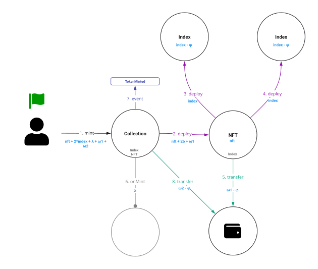
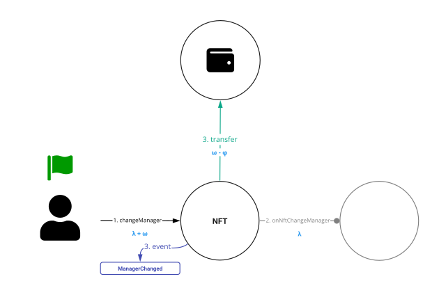
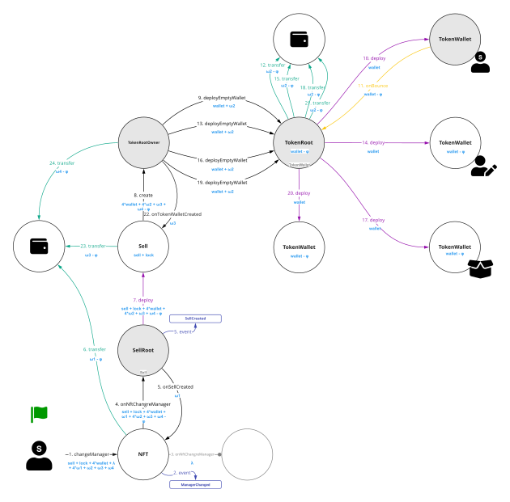
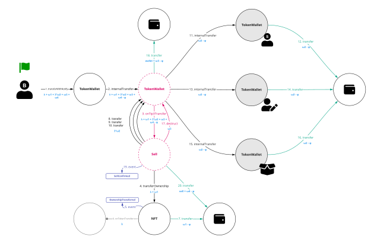

# Non-Fungible Token (TIP-4.1)

Requires: [TIP-6.1](./../TIP-6/1.md)

## Abstract

The following standard allows for implementing a standard API for NFTs within smart contracts. General information about NFT collection is stored in the NFT collection contract. Each NFT deployed in separate smart contracts and links to NFT collection contract.

This standard provides basic functionality to create, track and transfer NFTs.

## Motivation

A standard interface allows any NFT to be re-used by other applications: wallets, explorers, marketplaces, etc.

## Specification

The keywords “MUST”, “MUST NOT”, “REQUIRED”, “SHALL”, “SHALL NOT”, “SHOULD”, “SHOULD NOT”, “RECOMMENDED”, “MAY”, and “OPTIONAL” in this document are to be interpreted as described in [RFC 2119](https://datatracker.ietf.org/doc/html/rfc2119).


## Collection

The contract represents shared information about NFT collection and logic for creation of NFTs and burn of NFTs.

Every TIP4.1 compliant collection contract must implement the `TIP4_1Collection` interface and [TIP-6.1](./../TIP-6/1.md) interfaces

```solidity
pragma ton-solidity >= 0.58.0;

interface TIP4_1Collection {

    /// @notice This event emits when NFTs are created
    /// @param id Unique NFT id
    /// @param nft Address NFT contact
    /// @param owner Address of NFT owner
    /// @param manager Address of NFT manager
    /// @param creator Address of creator that initialize mint NFT
    event NftCreated(uint256 id, address nft, address owner, address manager, address creator);

    /// @notice This event emits when NFTs are burned
    /// @param id Unique NFT id
    /// @param nft Address NFT contact
    /// @param owner Address of NFT owner when it burned
    /// @param manager Address of NFT manager when it burned
    event NftBurned(uint256 id, address nft, address owner, address manager);


    /// @notice Count active NFTs for this collection
    /// @return count A count of active NFTs minted by this contract except for burned NFTs
    function totalSupply() external view responsible returns (uint128 count);

    /// @notice Returns the NFT code
    /// @return code Returns the NFT code as TvmCell
    function nftCode() external view responsible returns (TvmCell code);

    /// @notice Returns the NFT code hash
    /// @return codeHash Returns the NFT code hash
    function nftCodeHash() external view responsible returns (uint256 codeHash);

    /// @notice Computes NFT address by unique NFT id
    /// @dev Return unique address for all Ids. You find nothing by address for not a valid NFT
    /// @param id Unique NFT id
    /// @return nft Returns address of NFT contract
    function nftAddress(uint256 id) external view responsible returns (address nft);
}
```
**NOTE** The [TIP-6.1](./../TIP-6/1.md) identifier for this interface is `0x1217AAAB`.

### TIP4_1Collection.totalSupply()
```solidity
function totalSupply() public view responsible returns (uint128 count);
```
* `count` (`uint128`) -  A count of active NFTs

The function return count of active NFTs. Value increased by one when NFT minted and decreased by one when NFT burned.

### TIP4_1Collection.nftCode()
```solidity
function nftCode() public view responsible returns (TvmCell code);
```
* `code` (`TvmCell`) - NFT code

NFTs is a smart contract deployed from `collection` smart contract use nftCode and id.

### TIP4_1Collection.nftCodeHash()
```solidity
function nftCodeHash() public view responsible returns (uint256 codeHash);
```
* `codeHash` (`uint256`) - NFT codeHash

A codeHash allows search all smart contracts using base [dApp](https://main.ton.dev/graphql) functionality.

### TIP4_1Collection.nftAddress()
```solidity
function nftAddress(uint256 id) public view responsible returns (address nft);
```
* `id` (`uint256`) - Unique NFT id
* `nft` (`address`) - The NFT address

Computes NFT address by unique NFT id. You can check the NFT for availability using base [dApp](https://main.ton.dev/graphql) functionality.

### Events
```solidity
event NftCreated(uint256 id, address nft, address owner, address manager, address creator);
event NftBurned(uint256 id, address nft, address owner, address manager);
```
* `id` (`uint256`) - Unique NFT id
* `nft` (`address`) - The NFT address
* `owner` (`address`) - The initial\last owner of the NFT
* `manager` (`address`) - The initial\last manager of the NFT
* `creator` (`address`) - The initial address who initiate NFT deploy

You must emit `NftCreated` event when NFT minted.

You must emit `NftBurned` event when NFT burned.

### Mint and burn NFT

A function's signature is not included in the specification.

See the [Events](#Events) for your responsibilities when creating or burning NFTs.

## NFT

The contract represents information about current NFT and control logic. Each NFT contains two roles:
* owner logic
* manager logic

The owner’s address is the address that owns this NFT. The owner can see NFT in wallets, marketplaces, apps. The owner can use the NFT for authorization, for proof in games etc.

Manager address is the address that controls this NFT. Manager can burn NFT, can change the owner or change the manager (transfer the manager role).

Owner address and manager address can be same usually. When an NFT is put up for sale, it means that the manager's address is the address of the smart contract with the sell logic. It's same for farming logic or custom logic for use NFT.

Good practice is to set a manager address to a new owner address when owner changed.

Every TIP4.1 compliant NFT contract must implement the `TIP4_1NFT` interface and [TIP-6.1](./../TIP-6/1.md) interfaces.

```solidity
pragma ton-solidity >= 0.58.0;

interface TIP4_1NFT {

    struct CallbackParams {
        uint128 value;      // ever value will be sent to address
        TvmCell payload;    // custom payload will be proxied to address
    }

    /// @notice The event emits when NFT is created
    /// @dev Emit the event when NFT is ready to use
    /// @param id Unique NFT id
    /// @param owner Address of NFT owner
    /// @param manager Address of NFT manager
    /// @param collection Address of collection smart contract that mint the NFT
    event NftCreated(uint256 id, address owner, address manager, address collection);

    /// @notice The event emits when NFT owner changed
    /// @param oldOwner Address of NFT owner before owner changed
    /// @param newOwner Address of new NFT owner
    event OwnerChanged(address oldOwner, address newOwner);

    /// @notice The event emits when NFT manager changed
    /// @param oldManager Address of NFT manager before manager changed
    /// @param newManager Address of new NFT manager
    event ManagerChanged(address oldManager, address newManager);

    /// @param id Unique NFT id
    /// @param owner Address of NFT owner
    /// @param manager Address of NFT manager
    /// @param collection Address of collection smart contract, that mint the NFT
    event NftBurned(uint256 id, address owner, address manager, address collection);

    /// @notice NFT info
    /// @return id Unique NFT id
    /// @return owner Address of NFT owner
    /// @return manager Address of NFT manager
    /// @return collection Address of collection smart contract
    function getInfo() external view responsible returns(uint256 id, address owner, address manager, address collection);

    /// @notice Change NFT owner
    /// @dev Invoked from manager address only
    /// @dev Emit OwnerChanged
    /// @param newOwner New owner of NFT
    /// @param sendGasTo Address to send remaining gas
    /// @param callbacks Callbacks array to send by addresses. It can be empty
    function changeOwner(address newOwner, address sendGasTo, mapping(address => CallbackParams) callbacks) external;

    /// @notice Change NFT manager
    /// @dev Invoked from manager address only
    /// @dev Emit ManagerChanged
    /// @param newManager New manager of NFT
    /// @param sendGasTo Address to send remaining gas
    /// @param callbacks Callbacks array to send by addresses. It can be empty
    function changeManager(address newManager, address sendGasTo, mapping(address => CallbackParams) callbacks) external;

    /// @notice Change NFT owner and manager
    /// @dev Invoked from manager address only
    /// @dev Emit OwnerChanged
    /// @dev Emit ManagerChanged
    /// @param to New NFT owner and manager
    /// @param sendGasTo Address to send remaining gas
    /// @param callbacks Callbacks array to send by addresses. It can be empty
    function transfer(address to, address sendGasTo, mapping(address => CallbackParams) callbacks) external;
}
```
**NOTE** The [TIP-6.1](./../TIP-6/1.md) identifier for this interface is `0x78084F7E`.

### TIP4_1NFT.getInfo()
```solidity
function getInfo() public view responsible returns(uint256 id, address owner, address manager, address collection);
```
* `id` (`uint256`) -  Unique NFT id
* `owner` (`address`) - The owner of the NFT
* `manager` (`address`) - The manager of the NFT
* `collection` (`address`) - The NFT collection address

### TIP4_1NFT.changeOwner()
```solidity
function changeOwner(address newOwner, address sendGasTo, mapping(address => CallbackParams) callbacks) external;
```
* `newOwner` (`address`) -  New owner of NFT
* `sendGasTo` (`address`) - Address to send remaining gas. It sent to all callback addresses, too
* `callbacks` (`mapping(address => CallbackParams)`) - Callbacks uses for asynchronous calls to another addresses

**CallbackParams:**

| Field name  | type    | Description                         |
|-------------|---------|-------------------------------------|
| **value**   | uint128 | Ever values that send with callback |
| **payload** | TvmCell | Custom payload will send to address |

Change NFT owner. You must emit `OwnerChanged` event when NFT owner changed. The NFT sends callbacks if `callbacks` not empty.

### TIP4_1NFT.changeManager()
```solidity
function changeManager(address newManager, address sendGasTo, mapping(address => CallbackParams) callbacks) external;
```
* `newManager` (`address`) - New manager of NFT
* `sendGasTo` (`address`) - Address to send remaining gas. It sent to all callback addresses too
* `callbacks` (`mapping(address => CallbackParams)`) - Callbacks uses for asynchronous calls to another addresses

**CallbackParams:**

| Field name  | type    | Description                         |
|-------------|---------|-------------------------------------|
| **value**   | uint128 | Ever values that send with callback |
| **payload** | TvmCell | Custom payload will send to address |

Change NFT manager. You must emit `ManagerChanged` event when NFT owner changed. The NFT sends callbacks if `callbacks` not empty.

### TIP4_1NFT.transfer()
```solidity
function transfer(address to, address sendGasTo, mapping(address => CallbackParams) callbacks) external;
```
* `to` (`address`) - New NFT owner and manager
* `sendGasTo` (`address`) - Address to send remaining gas. It sent to all callback addresses too
* `callbacks` (`mapping(address => CallbackParams)`) - Callbacks uses for asynchronous calls to another addresses

**CallbackParams:**

| Field name  | type    | Description                         |
|-------------|---------|-------------------------------------|
| **value**   | uint128 | Ever values that send with callback |
| **payload** | TvmCell | Custom payload will send to address |

Change NFT manager. You must emit `OwnerChanged` and `ManagerChanged` events when NFT owner changed. The NFT sends callbacks if `callbacks` not empty.

### NFT events
```solidity
event NftCreated(uint256 id, address owner, address manager, address collection);
event OwnerChanged(address oldOwner, address newOwner);
event ManagerChanged(address oldManager, address newManager);
event NftBurned(uint256 id, address owner, address manager, address collection);
```
* `id` (`uint256`) - Unique NFT id
* `owner` (`address`) - The initial\last owner of the NFT
* `manager` (`address`) - The initial\last manager of the NFT
* `collection` (`address`) - The collection address who initiate NFT deploy

You must emit `NftCreated` event, when NFT created, initialized and ready to use.

You must emit `OwnerChanged` event every time when owner address changed.

You must emit `ManagerChanged` event every time when manager address changed.

You must emit `NftBurned` event when NFT burned.

Events emit when NFTs are created, burned or moved to a new owner\manager.

### Mint NFT

A function and constructor signature is not included in the specification.

The NFT must deploy from collection smart contract.

The NFT must emit `NftCreated` event after NFT deployed and ready to use.

See the [NFT events](#NFT events) for your responsibilities when creating NFT.

### Burn NFT

A function signature is not included in the specification.

The NFT must emit `NftBurned` event before NFT burned.

The NFT must send an internal message to collection contract before NFT burned.

See the [Events](#Events) for your responsibilities when burning NFT.

### ChangeOwner callback processing

Smart contract that processing callback message must implement.

```solidity
interface INftChangeOwner {

    struct CallbackParams {
        uint128 value;      // ever value will send to address
        TvmCell payload;    // custom payload will be proxied to address
    }

    /// @notice change owner callback processing
    /// @param id Unique NFT id
    /// @param manager Address of NFT manager
    /// @param oldOwner Address of NFT owner before owner changed
    /// @param newOwner Address of new NFT owner
    /// @param collection Address of collection smart contract, that mint the NFT
    /// @param sendGasTo Address to send remaining gas
    /// @param payload Custom payload
    function onNftChangeOwner(
        uint256 id,
        address manager,
        address oldOwner,
        address newOwner,
        address collection,
        address sendGasTo,
        TvmCell payload
    ) external;
}
```

### ChangeManager callback processing

Smart contract that processing callback message must implement.

```solidity
interface INftChangeManager {
    struct CallbackParams {
        uint128 value;      // ever value will send to address
        TvmCell payload;    // custom payload will proxying to address
    }

    /// @notice change owner callback processing
    /// @param id Unique NFT id
    /// @param owner Address of NFT owner
    /// @param oldManager Address of NFT manager before manager changed
    /// @param newManager Address of new NFT manager
    /// @param collection Address of collection smart contract that mint the NFT
    /// @param sendGasTo - Address to send remaining gas
    /// @param payload - Custom payload
    function onNftChangeManager(
        uint256 id,
        address owner,
        address oldManager,
        address newManager,
        address collection,
        address sendGasTo,
        TvmCell payload
    ) external;
}
```

### Transfer callback processing

Smart contract that processing callback message must implement.

```solidity
interface INftTransfer {

    struct CallbackParams {
        uint128 value;      // ever value will send to address
        TvmCell payload;    // custom payload will proxying to address
    }

    /// @notice change owner callback processing
    /// @param id Unique NFT id
    /// @param oldOwner Address of NFT owner before transfer
    /// @param newOwner Address of new NFT owner
    /// @param oldManager Address of NFT manager before transfer
    /// @param newManager Address of new NFT manager
    /// @param collection Address of collection smart contract that mint the NFT
    /// @param sendGasTo Address to send remaining gas
    /// @param payload Custom payload
    function onNftTransfer(
        uint256 id,
        address oldOwner,
        address newOwner,
        address oldManager,
        address newManager,
        address collection,
        address sendGasTo,
        TvmCell payload
    ) external;
}
```

## Visualization
### Legend


### `Collection` deployment


### Minting


### Burning


### Change owner


### Change manager


### Example how to use NFT. Put on sell using `changeManager()`


### Example how to use NFT. Buy using `changeOwner()`


### Example how to use NFT. Put on sell by [TIP-3.1](../TIP-3/1.md) tokens


### Example how to use NFT. Buy for [TIP-3.1](../TIP-3/1.md) tokens



## References

- [Ethereum EIP-721](https://eips.ethereum.org/EIPS/eip-721)
- [Solana v1.2.0](https://docs.metaplex.com/token-metadata/specification)
- [TON NFT](https://github.com/ton-blockchain/TIPs/issues/62), [TON DATA](https://github.com/ton-blockchain/TIPs/issues/64)
- [Tezos TZIP12](https://gitlab.com/tezos/tzip/-/blob/master/proposals/tzip-12/tzip-12.md)
