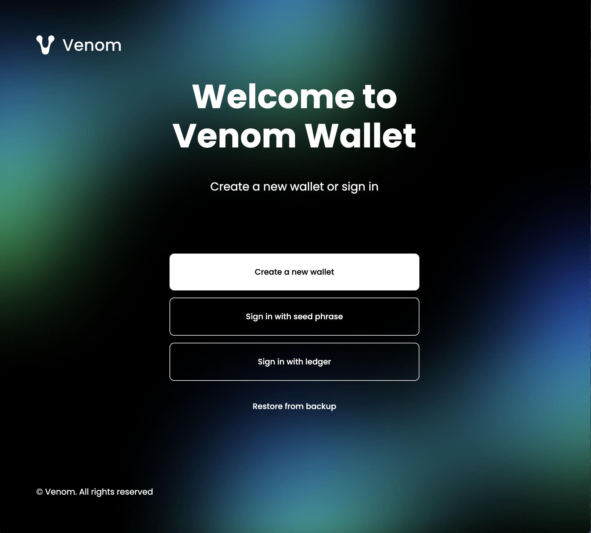
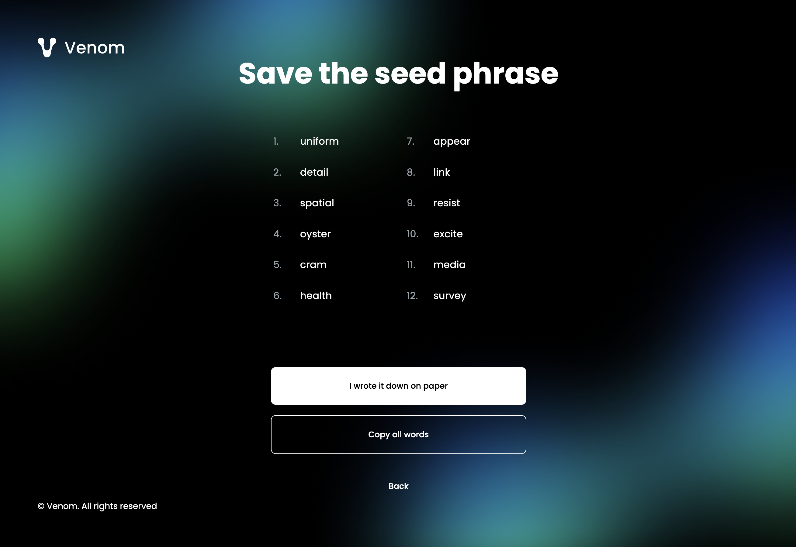
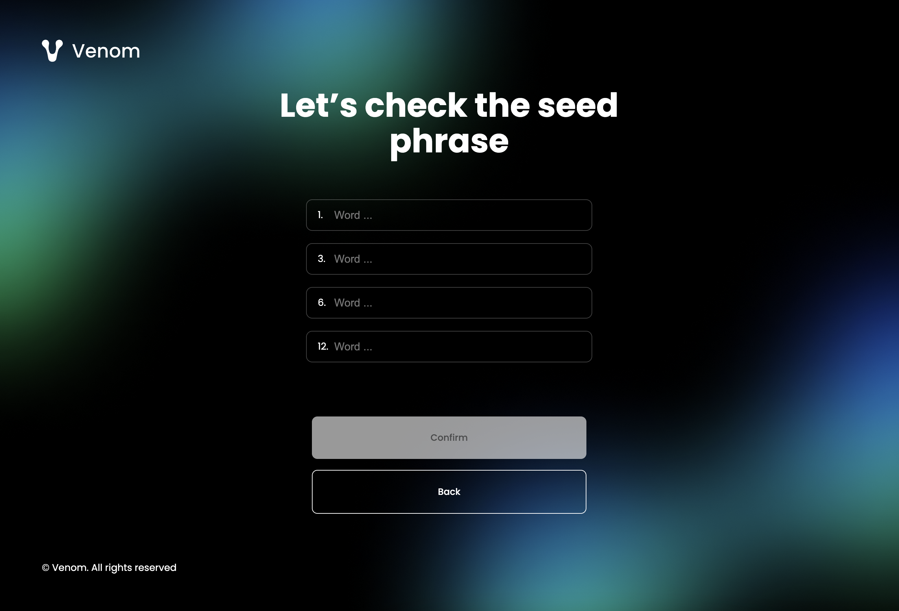
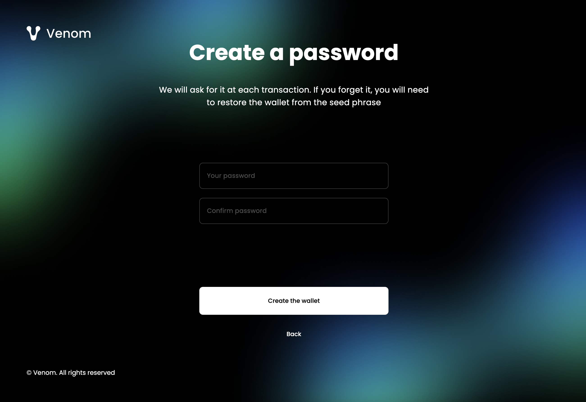

import Image from '@theme/IdealImage';
import img07 from './assets/create-a-new-wallet-account/7.png';
import img08 from './assets/create-a-new-wallet-account/8.png';

# Create a new Wallet Account

The Wallet Account is your identity in the Venom blockchain and a place to
securely keep your Venom tokens.

## Venom Wallet Browser Extension

The easiest way to create a new Wallet Account is to use Venom Wallet for this.
Venom Wallet is a Non-custodial gateway to the Venom ecosystem.

### Install Venom Wallet

The Browser Extension is available to install for Google Chrome Browser
\[Link to Chrome Webstore]

**Step 1.** The first thing you will be asked after installing the extension is
to select the wallet setup option:

* Create a new wallet - You need to use this option if you have not used
a wallet before and do not have a saved seed phrase
* Sign in with seed phrase - If there is already a seed phrase then import
the already created using this button
* Sign in with ledger - For using a ledger hardware wallet

**Step 2.** We will consider the option when you first create a wallet.
In this way, you need to read and agree (or not) with
[the privacy policy](https://venom.foundation/policy.html) of Venom Wallet

Check the checkbox next to the text "I accept..." and click the Submit button

**Step 3.** The Wallet will generate a unique seed phrase for you, keep it and
store it in a safe place. It is a very important step because a seed phrase
gives you access to the tokens and other things associated with your Wallet Account.

We recommend you use **the paper and pencil backup** method. For storing
on paper writing with a pencil is much better than pen. The paper should be
acid-free or archival paper and stored in the dark avoiding extremes of heat
and moisture.

When you saved the seed phrase in a safe place, then click "I wrote it down on paper"

**Step 4.** We really care about you and want to make sure you save the seed phrase

Enter the words from the backup list to confirm that you actually wrote them
down, then click the "Confirm" button.

**Step 5.** Create the password of your wallet. This password is used to encrypt
your seed phrase in your wallet and decrypt it when you sign transactions.
If you lost it, you can restore the wallet from the seed phrase.

Enter your password and click the "Create a wallet" button.

**Step 6.** To pin the Venom Wallet Browser Extension to Chrome.

**Step 7.** To receive the first tokens on your wallet you need to share the
address of your new Account with the token sender

<Image img={img07} alt="Receive tokens"
    style={{ width: "48%", display: "inline-block", marginRight: "4%" }}
    className="create-a-new-wallet-account inline-img"
/>
<Image img={img08} alt="Address showing"
    style={{ width: "48%", display: "inline-block" }}
    className="create-a-new-wallet-account inline-img"
/>

Click on the "Receive" button and copy the address or show the QR code for the sender.

Now you have the wallet to store your VENOMs, transfer funds, and explore your transactions.

The next step is to learn [how to transfer your tokens](04-balance-transfers.md).
