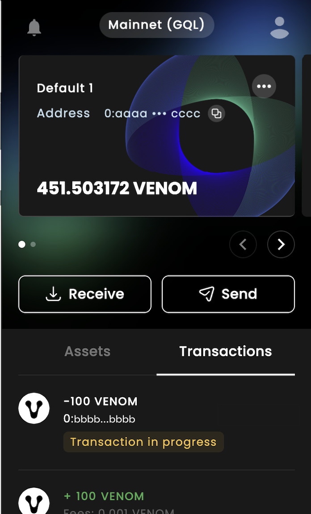

# Balance Transfers

A popular case of using blockchains is fund transfers from one account to another.

:::caution
This guide assumes that you've already [created a Wallet Account](03-create-a-new-wallet-account.md) and you [got some tokens](ecosystem/#venomget)
:::

To start transferring we will use [Venom Wallet Browser Extension](ecosystem/#venom-wallet).

**Step 1.** Let's open it and click the "Send" button

.png>)

**Step 2.** Now you see a popup window that asks you to enter four inputs

* "VENOM": The token that will be sent, you can choose other tokens here
* "Amount": The number of tokens you will transfer to the receiver
* "Receiver Address": The address of the receiver that will receive tokens
* "Comment": The text message for the receiver

After correctly filling in the input data, click the "Next" button

**Step 3.** You will be directed to the confirmation message screen**.**&#x20;

Make sure you have filled in all fields correctly**,** enter your password, and click the "Confirm transaction" button

.png>)

After you have confirmed the sending, the window will close.

**Step 4.** Open Venom Wallet again and click the "Transactions" tab, look in the list of transactions you will see a transaction in the status "Transaction in progress", after a while it will be processed by the network and change its status.

 

Now, you can see your transactions in [the explorer](02-ecosystem.md/#explorer).
