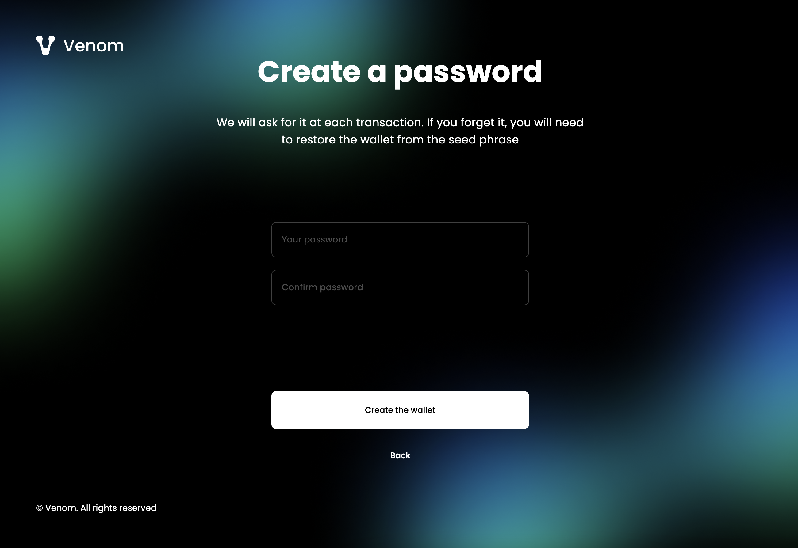

# How to Create a New Account with Venom Wallet
### Generating the seed phrase

To start experiencing the Venom Blockchain the user would first need to create a new Venom wallet account.
There are different types of accounts on the Venom Wallet platform - a personal account (default) or multisig for a corporate use. Therefore, the seed phrase will be created with a one default wallet account. The easiest way to create a new Wallet Account is to install the Venom Wallet Browser extension or download the application for IOS or for Android devices.

**Here is a universal step-by-step guide on how to set up a new account on Venom Wallet secured with the seed phrase and the password:**

 **Step 1.** Launch the extension/application and select the wallet setup option - “create a new account”.  

 

 **Step 2.** Read the decentralization policy and if you agree tick “I accept”.  
 **Step 3.** Click the “submit” button. 

   

 **Step 4.** The unique seed phrase will be auto-generated.  
  
    

:::info
We strongly recommend to keep it in the “safe environment”, never hand it over to someone and do not share it with third parties. Once created, the seed phrase gives access to the funds and information related to your wallet account. Make sure to save your seed phrase, just click the “copy” button to transfer the words to your device. We, as well, recommend to backup the seed phrase written down on a sheet of paper and store it in a dark cool place. When done, select an “I wrote it down on paper”.
:::

**Step 5.** Fill in the words and click confirm to verify that the unique seed phrase has been remembered. If the insertion was successful you will proceed to creation of the wallet password.  

   

**Step 6.** Create a password to secure the wallet transactions process (the password must be at least 8 characters long, containing uppercase, lowercase, number and special character).  

   

**Step 7.** Confirm your password entering it twice and click the “create a wallet” button.  

   

:::info We advise you to also make the seed phrase backup on your PC from your wallet account before logging out. Use the wallet extension. Click on the upper-right corner profile icon and select the “manage seeds” button, then choose “backup all”. The extension will automatically generate the .json file on your device. You can now use this file to restore the seed phrase.
:::

**A new default wallet account with the seed phrase has been created!**
