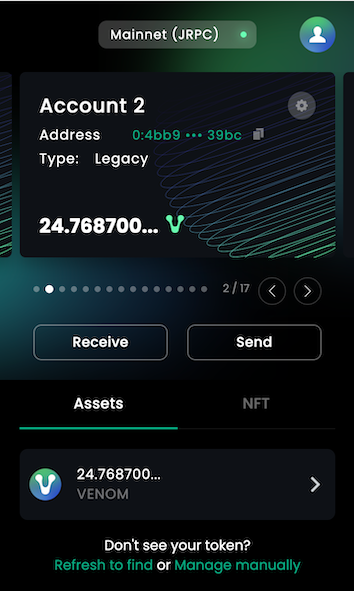

# The Main Screen of the Wallet Extension

  On this screen the user finds the essential instrumentarium for the account management.

   

## Profile

Click the profile button to access the seeds manager. From this menu you can make a backup of your seed phrase(s) on your PC, the backup will be automatically generated by the mechanism of the wallet extension.

## Wallets

Wallets are represented with the card-like icons. To switch between the different wallet accounts or add a new one swipe right using “arrows” (or click on the right corner of it). To review the wallet information use the “gear” icon on the top right corner.

>   
> 
:::info info
Use the Explorer to have a detailed look into wallet transaction history.
:::

## Transaction buttons

To perform quick and effortless transactions, use functional buttons — “Receive” and “Send”. Use “Assets” and “Transactions” for quick display of the assets and the history of performed transactions.

  

:::info info
To discover the address of the particular crypto asset, click on the asset’s icon.
:::
  

In the bottom of the wallet window the user would find some complementary commands.

Use “Refresh to find” to manually refresh the main page. “Manage (assets) manually” — from this menu the user can manually add a custom token (entering token route) to the wallet account or manually search for a token.

Enjoy your fast and effortless crypto trading with the Venom Wallet.
