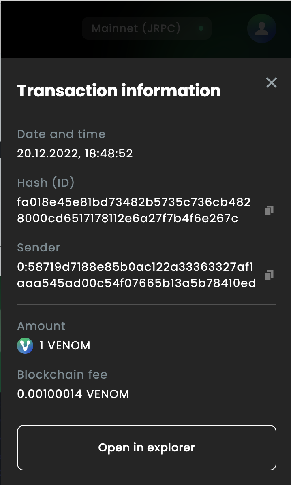

# Transactions

## Revising history and details
  

For the user convenience a vital transactional data is always available on hand in the Venom Wallet.

   

**Here a few steps for checking your transaction history via wallet extension:**

  

1. Launch an application and log in to your account.
2. Open the homepage of the wallet window.
3. Select assets, then click on the transaction field of your choice to see details.

  

The list of the current wallet’s operational activity (such as date and time, amount, hash ID, transaction’s addresses and gas fee paid) would be available to the user. You may fast-check the data of every wallet added to your Venom blockchain account, by changing the wallet’s priority on the UI.

  

:::info info
To discover the detailed information on your crypto operations made on the Venom blockchain, we recommend using a
specialized tool – Venom Scan.
:::
  

**You can access the tool right from the “Transactions” in your account:**

  

1. In the wallet explorer extension homepage, select assets, then click on the transaction field of your choice to see details.
2. Select “Open in explorer”.
    

  

The user as well can find the link to the explorer tool, manually choosing the wallet from the homepage of the extension.

  

1. Click on the “gear” icon.
2. Choose to “View in the explorer”.
    

  

You will be redirected to the Venom Scan website, where you can enjoy this tool.
