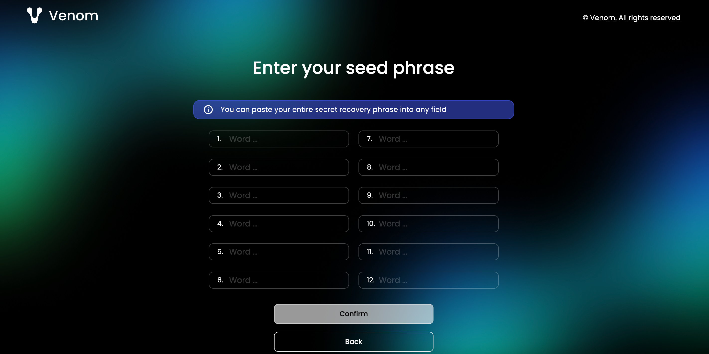

# How to Sign in into the Wallet Account Using the Seed Phrase?

## Restoring your seed phrase

  
  

To sign in into your Venom wallet account the user should use a unique seed phrase as a key. This verification method is considered as a more secure and infeasible method to perform.

  

:::info info
We recommend backing it up with the wallet extension on your PC and using the ‘pen or pencil method”. Never share it with third
parties! Remembering your seed phrase is highly important, it allows
you to set up a new wallet, connect it on a phone, browser or hardware
device and regain access to your wallet transactions.
:::

####  How to sign in using an existing seed phrase:

  
1. Launch the extension/application and select the wallet “sign in with the seed phrase” option.

   

2. Enter your whole unique series of words in accordance to its sequence in the seed phrase. (The interface allows you to transfer the whole phrase automatically in one click, pasting it into any field).

   

3. Enter the password that you will then specify to confirm actions in the wallet.

   

4. Open the extension/application to perform transactions.

  

:::info info
Make sure you have made the seed phrase backup with the wallet extension, before logging out the account . See, how to back up
your seed phrase using your account [here](how-to-create-a-backup-file.md).
::: 

  

**In case if the seed phrase has been forgotten, the user may recover the phrase from a .json file backup on the computer to sign into the account:**

  

 1. Launch the extension/application and select the wallet
   “recover from backup” option from the login page.
 2. The dialog window appears. Select your generated .json file
   from your computer. Click “open”.
 3. The seed phrase will be filled in the gap automatically and
   the user logged in.

  

The wallet account now would be available to the user to perform transactions.
