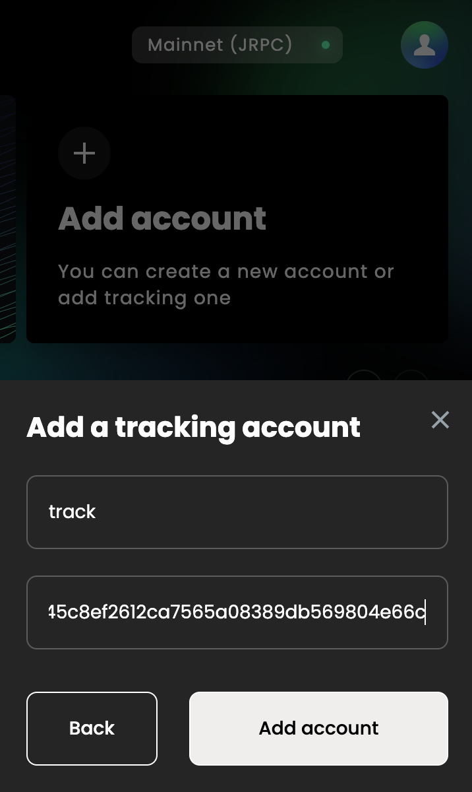
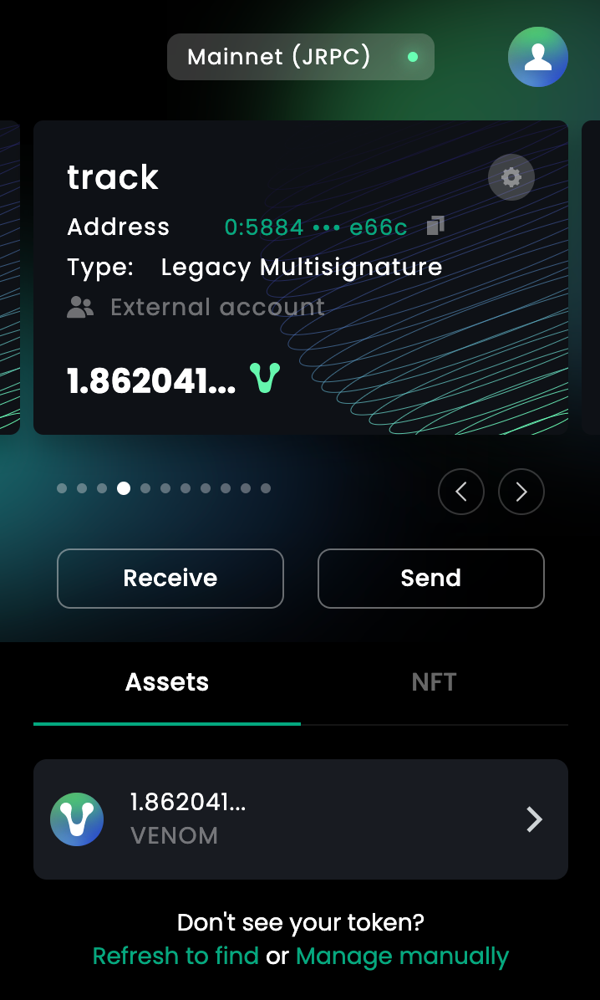

# Creating Tracking Account
:::info info
To add a Tracking Account  make sure that the Public key of the Default account has been set as a custodian by the Multisignature account (for which a new Tracking Account is being created).
:::

**Here is a few steps to follow creating a new Tracking Account:**
1. On the Main screen, scroll your existing accounts to the right until you reach the “Add Account” option.
2. Upon choosing the Add Account option, you will be prompted to choose between the following 2 options: “Add Account” and “Add a tracking account”. Click on “Add a tracking account” option and then click Next.

   

3. In the next window enter a name for new Tracking Account and paste the address of the Multisignature account.

   

4. Click Add account – your tracking account is ready to use.

   

Your new Tracking Account is now ready to use. From now on, you may perform transactions with this Account as an owner.
