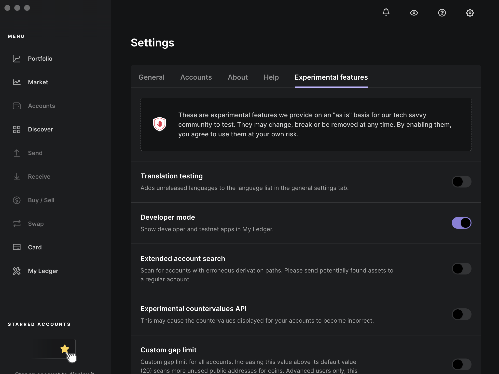

# Installing Venom on Ledger Live

:::info
Before you will be able to set up Venom Wallet on your Ledger device you have to install the Venom App on it.
:::

 To use Venom Wallet with Ledger devices the user should firt install Venom app via Ledger Live software. 

 
 **Here is a quick installation guide for you to follow:**
1.  Connect your Ledger device.
2.  Open Ledger Live software.
3.  Go to Settings (Gear icon).
4.  Go to the Experimental features tab.
5.  Scroll down to the Developer mode and switch it on.

   

6.  Go to My Ledger (linear and wrench icon).
7.  Search for Venom App by starting typing Venom into the search bar.
8.  Click Install to install the Venom App.

   

The Ledger Live will install Venom on your Ledger device. Once a green checkmark appears, the Venom App has been installed onto your device.
